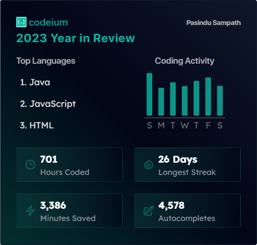

<h1 align="center">Dσ  Sσɱҽƚԋιɳɠ  Tԋαƚ  Nσ  Oɳҽ   Cαɳ  Iɱαɠιɳҽ
</h1>
<h1 align="center">Hi 👋, I'm 👽</h1>
<h3 align="center">a Student , a Tutor , an Associate Software Engineer</h3>

# 💫 About Me:

- 👨‍💻 Visit My <a href="https://pasindusampath.com/">PORTFOLIO</a>  -
- 💬 Ask me about **JAVA,JAVAFX,MYSQL,Hibernate,Javascript,HTML,CSS**  -
- 📫 How to reach me **hello@pasindusampath.com** -

##
 
<h4><a href="https://www.canva.com/design/DAGtM2U07_k/EP78dUP16BRk0PK0YA-GWg/view?utm_content=DAGtM2U07_k&utm_campaign=designshare&utm_medium=link2&utm_source=uniquelinks&utlId=hae7b59934d"> Git and Github PPTX</a> </h4>
##

</>CODEIUM

##

## 🌐 Socials:
  

# 💻 Tech Stack:
        	    

# 📊 GitHub Stats:
 
 

## 🏆 GitHub Trophies

### ✍️ Random Dev Quote

### 🔝 Top Contributed Repo

---

